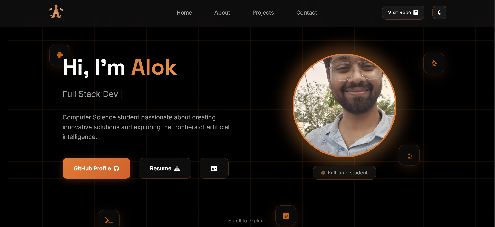

# Alok Singh – Portfolio Website

Personal portfolio for Alok Singh (Full Stack Developer & Data Science enthusiast).  
Built with semantic HTML, modern CSS animations, and vanilla JavaScript.  
Includes Formspree-powered contact form, downloadable resume, and a custom “Nexus Card”.

- [Live Preview (local dev instructions)](#quick-start)
- [Contact Form (Formspree `manayweg`)](#contact-form)
- [Customization Cheatsheet](#customization)

---

## ✨ Highlights

- Dark-first UI with smooth theme toggle and glassmorphism accents
- Animated hero, timeline-based About section, and filterable projects
- Dynamic contact form with inline validation and notification system
- “Nexus Card” mini profile and downloadable resume (`Alok's CV.pdf`)
- Mobile-friendly layout built from scratch (no frameworks)



---

## 🛠️ Tech Stack

- HTML5 + CSS3 (Grid, Flexbox, custom properties)
- Vanilla JavaScript (modules, animations, fetch API)
- Formspree (`https://formspree.io/f/manayweg`) for contact delivery
- Font Awesome icons, Google Fonts, custom illustrations

---

## Quick Start

```bash
git clone https://github.com/AlokSingh04/alok_portfolio.git
cd alok_portfolio/portfolio
python -m http.server 8000
# open http://localhost:8000 in your browser
```

*Alternative:* `npx serve` or VS Code “Live Server”.

---

## Contact Form

- Endpoint: `https://formspree.io/f/manayweg`
- Post-submit flow:
  - Success toast
  - Auto-reset form
  - Redirect to `thank-you.html`
- Failure flow redirects to `error.html` and keeps button state safe

To change the recipient email, update the Formspree dashboard.  
If you point to a new endpoint, update both:

- `index.html` → `<form action="...">`
- `assets/js/script.js` → `fetch('...')`

---

## Project Structure

```
portfolio/
├── index.html
├── thank-you.html / error.html
├── assets/
│   ├── css/ (global styles + card styles)
│   ├── js/ (main app + nexus card manager)
│   ├── ele/ (images, profile photo, logos)
│   ├── fonts/Alok's CV.pdf (resume download)
│   └── config/
│       ├── projects.json
│       └── card-config.json
└── assets/nexus-card/index.html (standalone card)
```

---

## Customization

| What you want to change | Where to edit |
| --- | --- |
| Name, tagline, social links | `assets/config/card-config.json` & `index.html` |
| Projects grid | `assets/config/projects.json` |
| Resume | replace `assets/fonts/Alok's CV.pdf` |
| Hero portrait | replace `assets/ele/alok_profile.jpg` |
| Theme colors | CSS variables in `assets/css/style.css` |
| Nexus Card styling | `assets/nexus-card/index.html` & `assets/css/card-style.css` |

**Switching Form endpoint:** search for `formspree.io/f/` in the repo.

---

## Deploying

1. Push to GitHub (already done: `main` -> `AlokSingh04/alok_portfolio`)
2. Deploy options:
   - **Netlify**: drag `portfolio` folder or connect repository
   - **Vercel**: “Add New Project” → select repo → root `portfolio`
   - **GitHub Pages**: use GitHub Actions or publish from `portfolio` folder
3. Update any absolute links (e.g., `http://127.0.0.1:5175/...`) to production URLs

---

## Contact

- Email: `alokvinodsingh02@gmail.com`
- LinkedIn: [linkedin.com/in/alok-singh-8560b9295](https://www.linkedin.com/in/alok-singh-8560b9295/)
- GitHub: [@AlokSingh04](https://github.com/AlokSingh04)

---

Made with ☕ and curiosity. Star the repo if you like it! 🚀
